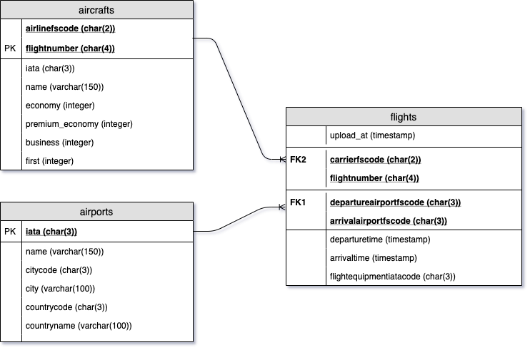

# Тестовое задание

Для выполнения задачи требуется вспомнить `python` и `git`. 
Изучить: `docker`, `docker compose`, `airflow`, `PostgreSQL`. Рекомендую тестировать в виртуальной машине Linux.
Cоветую взять один из готовых деплоев `airflow` и адаптировать - например, `puckel`.
Можно использовать для написания модулей скрапера `Java`.
Пункты, помеченные (*), не являются обязательными, но могут приятно отразиться на офере.

## Релизовать следующие пункты:
1. Написать скрапер для получения рейсов авиакомпании Аэрофлот из одного аэропорта в другой на заданный день с сохранением данных в `Postgres`;
2. Результат поиска должен включать: дата поиска, дата и время и вылета, откуда, куда, тип самолета, **(*)цена билета**;
3. В `Postgres` должны быть таблицы:
  - справочник IATA: код, наименование аэропорта, город, страна;
  - (*)справочник с типами бортов: код, количество мест в разных классах;
  - таблица с результатами парсера;
  - вьюху с подключенным справочником;
  - вьюху или процедуру, которая бы выявляла изменения в рейсах.
4. Создать `dag` для `airflow`, который бы ежедневно дергал скрапер данных для Аэрофлота для полетов из Новосибирска в Москву на неделю данных вперед. Можно использовать один и тот же `Postgres` для `airflow` и скрапера;
5. Даг должен включать в себя возможность ретроспективного выполнения;
6. В случае сбоя задачи должно быть оповещение по почте (хинт: можно после тестирования у себя убрать все подключения из конфига);
7. (*)Вынести в конфиг список направлений для парсера, чтобы можно было из него менять количество задач в даге;
8. Нарисовать схему данных `Postgres` в [draw.io](https://www.draw.io/) или подобном: 
9. Выложить готовый код в репозиторий на [github](https://github.com/) или [bitbucket](https://bitbucket.org/);
10. Репозиторий должен включать `docker compose`, который бы поднимал `airflow`, `Postgres` и скрапер из исходника;
11. **(*)Смоделировать `gitflow`, в котором бы этапы выполнения задачи представляли собой `merge-request`**.

Время на выполнение 2 недели. По готовности назначем встречу, разбираем код. Нужно быть готовым презентовать свои решения.

## Запуск

```bash
docker-compose build
docker-compose up postgres
docker-compose up initdb
docker-compose up scheduler webserver
docker-compose exec webserver airflow variables -i /usr/local/airflow/dags/config/variables.json
docker-compose exec webserver airflow connections -d --conn_id postgres_default
docker-compose exec webserver airflow connections -a --conn_id postgres_default --conn_type postgres --conn_host postgres --conn_schema airflow --conn_login airflow --conn_password airflow --conn_port 5432
```
## Примечание
  - **Жирным** шрифтом выделены пунты которые не успел выполнить. 
  - Вместо скрапинга данные "тянуться" по API [flightstats](https://developer.flightstats.com/api-docs/how_to)